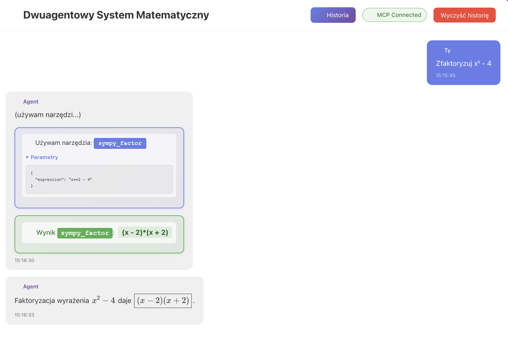

# 🤖 Agent Matematyczny z SymPy (Bielik-M)

Inteligentny agent AI z dostępem do narzędzi matematycznych SymPy, umożliwiający rozwiązywanie zaawansowanych problemów matematycznych.

## 📋 Opis



Bielik-M to aplikacja demonstrująca integrację agenta AI (Claude lub MLX) z Model Context Protocol (MCP) i narzędziami SymPy:

- **🤖 Agent Matematyczny** - Inteligentny agent AI który analizuje problemy matematyczne i używa odpowiednich narzędzi
- **🔧 MCP + SymPy** - 9 narzędzi do symbolicznych obliczeń matematycznych (rozwiązywanie równań, pochodne, całki, upraszczanie, itp.)
- **📐 LaTeX Rendering** - Pięknie sformatowane wzory matematyczne w interfejsie użytkownika

Agent automatycznie wybiera odpowiednie narzędzia SymPy, wykonuje obliczenia i prezentuje wyniki w czytelny sposób.

## ✨ Funkcje

- **🔧 9 Narzędzi SymPy** - Pełny zestaw narzędzi do symbolicznych obliczeń matematycznych
- **🤖 MCP Integration** - Integracja z Model Context Protocol dla standardowego interfejsu narzędzi
- **📐 LaTeX Rendering** - Automatyczne renderowanie wzorów matematycznych z KaTeX
- **🎯 Automatyczne wykrywanie zmiennych** - Wszystkie symbole w wyrażeniach są automatycznie definiowane
- **💬 Multi-Provider** - Wybór między Claude (cloud) a MLX (lokalny)
- **🇵🇱 Polski interfejs** - Kompletnie spolszczony UI
- **📜 Historia konwersacji** - Zapisywanie i wczytywanie poprzednich sesji
- **🔄 Wyświetlanie wyników narzędzi** - Przejrzyste pokazywanie wywołań i wyników narzędzi

## 🚀 Szybki start

### Wymagania

- Node.js 18+ lub nowszy
- **Dla Claude**: Klucz API Anthropic
- **Dla MLX**: Mac z Apple Silicon (M1/M2/M3/M4) i uruchomiony serwer MLX

### Instalacja

```bash
# Sklonuj repozytorium
git clone https://github.com/yourusername/bielik-m.git
cd bielik-m

# Zainstaluj zależności
npm install

# Uruchom aplikację w trybie deweloperskim
npm run dev
```

### Konfiguracja

#### Opcja 1: Claude (Cloud)

1. Otwórz aplikację w przeglądarce (domyślnie `http://localhost:5173`)
2. Wybierz provider "Claude (Anthropic)"
3. Wprowadź swój klucz API Anthropic
4. Kliknij "Rozpocznij"

**Uzyskiwanie klucza API:**
1. Odwiedź [console.anthropic.com](https://console.anthropic.com/)
2. Zarejestruj się lub zaloguj
3. Przejdź do sekcji API Keys
4. Wygeneruj nowy klucz API

#### Opcja 2: MLX (Lokalny - Apple Silicon)

1. Zainstaluj MLX:
   ```bash
   # Opcja 1: Homebrew (zalecane dla macOS)
   brew install mlx-lm

   # Opcja 2: pip
   pip install mlx mlx-lm
   ```

2. Uruchom serwer MLX:
   ```bash
   mlx_lm.server --model mlx-community/Llama-3.2-3B-Instruct-4bit

   # Lub na innym porcie:
   mlx_lm.server --model mlx-community/Llama-3.2-3B-Instruct-4bit --port 8080
   ```

3. W aplikacji:
   - Wybierz provider "MLX (Apple Silicon - lokalny)"
   - Wprowadź URL serwera (domyślnie `http://localhost:8080`)
   - Wprowadź nazwę modelu
   - Kliknij "Rozpocznij"

**Wymagania MLX:**
- Mac z Apple Silicon (M1/M2/M3/M4)
- macOS 14.0 lub wyższy
- Darmowy, lokalny inference bez kosztów API
- Akceleracja sprzętowa za pomocą Neural Engine

## 💻 Użycie

### Przykładowe pytania

```
Rozwiąż równanie kwadratowe: 2x² + 5x - 3 = 0
```

```
Oblicz pochodną funkcji f(x) = x³ + 2x² - 5x + 1
```

```
Jakie jest pole koła o promieniu 7 cm?
```

```
Rozwiąż układ równań:
2x + y = 5
x - y = 1
```

### Konfiguracja rund konwersacji

Możesz ustawić liczbę rund (1-5), w których agenty będą wymieniać informacje:

- **1 runda** - Szybka odpowiedź, każdy agent odpowiada raz
- **2 rundy** (domyślnie) - Dobra równowaga między jakością a czasem
- **3+ rundy** - Głębsza analiza dla złożonych problemów

## 🏗️ Architektura

### Struktura projektu

```
bielik-m/
├── src/
│   ├── services/
│   │   ├── agentService.ts      # Logika orkiestracji agentów
│   │   ├── mlxAgent.ts          # Implementacja MLX agenta
│   │   └── types.ts             # Typy TypeScript
│   ├── App.tsx                  # Główny komponent UI
│   ├── App.css                  # Style aplikacji
│   ├── main.tsx                 # Punkt wejścia
│   └── vite-env.d.ts           # Typy TypeScript
├── index.html
├── package.json
├── tsconfig.json
└── vite.config.ts
```

### Komponenty systemu

#### GroupChatOrchestrator

Główna klasa zarządzająca konwersacją między agentami z wsparciem dla wielu providerów:

```typescript
// Tworzenie orchestratora z Claude
const agents = createMathAgents();
const orchestrator = new GroupChatOrchestrator(
  'claude',
  agents,
  apiKey
);

// Tworzenie orchestratora z MLX
const orchestratorMLX = new GroupChatOrchestrator(
  'mlx',
  agents,
  undefined,
  {
    baseUrl: 'http://localhost:8080',
    model: 'mlx-community/Llama-3.2-3B-Instruct-4bit',
    temperature: 0.7,
    maxTokens: 4096
  }
);

// Rozpoczęcie konwersacji
await orchestrator.orchestrateConversation(
  "Rozwiąż równanie: x² - 5x + 6 = 0",
  rounds: 2,
  onMessageCallback: (message) => console.log(message)
);
```

#### Agenci matematyczni

Dwaj wyspecjalizowani agenci:

```typescript
const agents = createMathAgents();
// agents[0] - Analizator (analiza problemów)
// agents[1] - Kalkulator (wykonywanie obliczeń)
```

### Przepływ danych

```
Użytkownik → Wiadomość
    ↓
GroupChatOrchestrator
    ↓
Analizator (runda 1) → Strategia rozwiązania
    ↓
Kalkulator (runda 1) → Pierwsze obliczenia
    ↓
Analizator (runda 2) → Weryfikacja/doprecyzowanie
    ↓
Kalkulator (runda 2) → Finalne wyniki
    ↓
UI ← Kompletne rozwiązanie
```

## 🛠️ Technologie

- **React 18** - Biblioteka UI
- **TypeScript** - Typy statyczne
- **Vite** - Bundler i dev server
- **Anthropic SDK** - Integracja z Claude AI
- **MLX** - Apple Silicon optimized inference
- **CSS3** - Stylowanie (gradientowe, responsywne)

### Porównanie providerów

| Feature | Claude | MLX |
|---------|--------|-----|
| **Koszt** | Płatny (API) | Darmowy (lokalny) |
| **Jakość** | Bardzo wysoka | Dobra |
| **Szybkość** | Szybka | Bardzo szybka (z akceleracją) |
| **Prywatność** | Cloud | 100% lokalny |
| **Wymagania** | Klucz API | Apple Silicon Mac |
| **Offline** | ❌ | ✅ |

## 📦 Skrypty

```bash
# Tryb deweloperski z hot reload
npm run dev

# Build produkcyjny
npm run build

# Podgląd buildu produkcyjnego
npm run preview

# Linting
npm run lint
```

## 🔒 Bezpieczeństwo

- Klucz API jest przechowywany tylko w pamięci przeglądarki
- Komunikacja odbywa się bezpośrednio z API Anthropic (HTTPS)
- Brak przechowywania danych na serwerze
- Opcja `dangerouslyAllowBrowser: true` włączona dla demo (w produkcji użyj backendu)

## 🚨 Ważne uwagi

⚠️ **Uwaga bezpieczeństwa**: Aplikacja używa `dangerouslyAllowBrowser: true` do celów demonstracyjnych. W środowisku produkcyjnym klucz API powinien być przechowywany na backendzie, a komunikacja z Anthropic powinna odbywać się przez serwer proxy.

## 📚 Dodatkowa dokumentacja

- [MLX_GUIDE.md](MLX_GUIDE.md) - Kompletny przewodnik po MLX
- [EXAMPLES.md](EXAMPLES.md) - Przykłady użycia z MLX i Claude

## 🤝 Wkład w rozwój

Zachęcamy do zgłaszania issues i pull requestów!

## 📄 Licencja

MIT

## 👨‍💻 Autor

Projekt stworzony jako demonstracja group chat orchestration z agentami AI.

---
