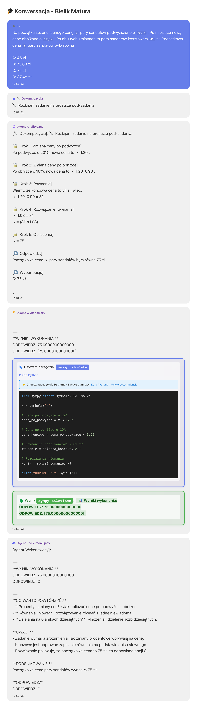

# 🎓 Formulo - Asystent Matematyczny

**Twój pomocnik w przygotowaniach do matury z matematyki rozszerzonej**

Zaawansowany asystent matematyczny oparty na polskim modelu AI Bielik, wyposażony w narzędzia do obliczeń symbolicznych (SymPy) i formalnej weryfikacji dowodów (Lean Prover). System prezentuje szczegółowe rozwiązania zadań maturalnych krok po kroku.

## 📋 O projekcie



**Formulo** to aplikacja stworzona z myślą o maturzystach przygotowujących się do egzaminu z matematyki na poziomie rozszerzonym. System został zaprojektowany w oparciu o analizę Informatora Maturalnego CKE i obejmuje wszystkie kluczowe obszary tematyczne:

### 📊 Zakres tematyczny (zgodny z Informatorami CKE)

**Algebra i równania** (Tematy I-IV):
- Liczby rzeczywiste, wyrażenia algebraiczne
- Równania, nierówności i układy równań
- Funkcje kwadratowe i parametry
- Równania wymierne i logarytmiczne

**Analiza matematyczna** (Tematy V, VI, VII, XIII):
- Funkcje i ich własności
- Ciągi i granice
- Rachunek różniczkowy i całkowy
- Trygonometria
- Zadania optymalizacyjne

**Geometria** (Tematy VIII-X):
- Geometria płaska (planimetria)
- Geometria analityczna
- Geometria przestrzenna (stereometria)

**Kombinatoryka i prawdopodobieństwo** (Tematy XI-XII):
- Zliczanie kombinatoryczne
- Prawdopodobieństwo i statystyka

### 🎯 Jak działa?

System przetwarza zadanie przez wieloetapowy pipeline:

```
Pytanie użytkownika
      │
      ├─→ 🎯 Lean Prover (TYLKO dla zadań-dowodów, opcjonalny)
      │   Próbuje udowodnić formalnie — jeśli się uda, kończy pipeline
      │   Jeśli nie, spada do normalnego pipeline ↓
      │
      ▼
 📚 RAG Service  ──────────────────────────────────────────────────┐
 (port 3003)                                                        │
 Wyszukuje metodę + podobne zadania (TF-IDF)                       │
      │                                                             │
      ▼                                                   kontekst RAG
 🔪 Dekompozycja (opcjonalna, zadania złożone)                     │
 Rozbija problem na 2-4 pod-zadania z formułami SymPy              │
      │                                                             │
      ▼                                                             │
 🗂️ Klasyfikator ─── typ zadania (równanie/geometria/...)          │
      │                                                             │
      ├─→ Deterministyczny solver (bez LLM!) ◄────────────────────┘
      │   (równania, pochodne, całki — bezpośrednio przez SymPy)
      │
      ├─→ Chain ekstrakcji (LLM → kod SymPy → wynik)
      │
      ├─→ Multi-step chain (LLM wielokrokowy)
      │
      └─→ Agent Analityczny + Agent Wykonawczy (fallback)
                │
                ▼
         🤖 Agent Podsumowujący
         (wyjaśnienie krok po kroku)
                │
                ▼
         🎯 Lean Verifier (Agent 4, wymagany)
         Formalizuje i weryfikuje dowód przez Lean 4
         (backend = 'lean' lub 'both' — brak Lean = błąd przy starcie)
```

**RAG** jest używany dwukrotnie:
1. **Przed analizą** — kontekst metody matematycznej trafia do promptu Agenta Analitycznego
2. **Przy generowaniu kodu** — wskazówki SymPy z RAG są wstrzykiwane do promptu Agenta Wykonawczego

Przy zadaniach kombinatorycznych wynik jest dodatkowo **weryfikowany brute-force** (przez wyliczenie wszystkich przypadków w Python) bez udziału LLM.

**Lean Verifier (Agent 4)** działa dwuetapowo:
1. **Formalizacja** — LLM tłumaczy rozwiązanie Agenta Podsumowującego na kod Lean 4 (prompt `formalizer_lean`)
2. **Weryfikacja** — kod Lean jest wysyłany do Lean Proxy (port 3002), który sprawdza poprawność formalną przez `lean --run`

Wynik weryfikacji jest dołączany do odpowiedzi:
- `✅ Rozwiązanie zweryfikowane przez Lean Prover` — dowód kompiluje się poprawnie
- `⚠️ Lean wykrył problemy` — kod Lean zawiera błędy logiczne lub typowe

Agent 4 jest aktywowany gdy:
- backend = `lean` lub `both` (domyślnie `both`)
- problem należy do typów wymagających dowodu (monotoniczność, indukcja, twierdzenia geometryczne)

> **Uwaga:** Lean Proxy jest **wymagany** przy backendzie `lean` lub `both`. Jeśli Lean 4 nie jest zainstalowany lub proxy nie działa na porcie 3002, aplikacja zwróci błąd przy starcie (`Lean Prover niedostępny — uruchom Lean Proxy na porcie 3002`). Użyj backendu `sympy` aby pominąć weryfikację formalną.

### 🔧 Możliwości systemu

**Obliczenia symboliczne (SymPy)**:
- Rozwiązywanie równań i układów równań
- Obliczanie pochodnych i całek
- Upraszczanie wyrażeń algebraicznych
- Analizy parametryczne
- Optymalizacja funkcji

**Formalne dowodzenie (Lean Prover)**:
- Weryfikacja dowodów matematycznych
- Dowody przez indukcję
- Dowody własności funkcji (monotoniczność, ciągłość)
- Twierdzenia geometryczne

**Baza wiedzy (RAG Service)**:
- Metody matematyczne z informatora maturalnego
- Podobne zadania z poprzednich matur
- Wskazówki i porady dla typowych problemów
- Kontekst egzaminacyjny i wymagania CKE

### 📈 Skuteczność na zadaniach maturalnych

Na podstawie analizy egzaminów maturalnych:
- **~70-75%** zadań może być rozwiązanych automatycznie
- **~85%** skuteczności dla zadań algebraicznych
- **~80%** skuteczności dla zadań z analizy matematycznej
- **~70%** skuteczności dla zadań geometrycznych
- **~75%** skuteczności dla kombinatoryki i prawdopodobieństwa

**Rodzaje zadań obsługiwane przez system:**
- ✅ Równania parametryczne i układy równań
- ✅ Analiza wielomianów i funkcji wymiernych
- ✅ Zadania optymalizacyjne (z pochodnymi)
- ✅ Granice i ciągi
- ✅ Trygonometria
- ✅ Geometria analityczna
- ✅ Zliczanie kombinatoryczne
- ✅ Prawdopodobieństwo (rozkłady, Bayes)
- ⚠️ Geometria syntetyczna (wymaga interpretacji diagramów)
- ⚠️ Zadania wymagające interpretacji wykresów

## ✨ Kluczowe cechy

### 🎯 Dla maturzystów

- **📝 Szczegółowe rozwiązania** - Każdy krok z wyjaśnieniem DLACZEGO, nie tylko CO
- **🔍 Proces rozumowania** - Agent pokazuje jak dojść do rozwiązania
- **💡 Wyniki pośrednie** - Wszystkie kroki obliczeń są widoczne
- **📐 Bez LaTeX** - Wzory w prostym, czytelnym formacie tekstowym
- **✅ Weryfikacja** - Sprawdzanie poprawności rozwiązań

### 🔧 Techniczne

- **🔄 Elastyczny Backend** - Wybór między SymPy, Lean Prover lub oba
- **🤖 Polski model AI** - Wykorzystuje Bielik (LibraxisAI/Bielik-11B-v3.0)
- **💬 Multi-Provider** - Claude (cloud) lub MLX (lokalny)
- **📜 Historia** - Zapisywanie i wczytywanie poprzednich sesji
- **🇵🇱 Polski interfejs** - W całości po polsku

## 🚀 Szybki start

### ⚡ Quick Start (TL;DR)

**Linux/macOS:**
```bash
git clone https://github.com/yourusername/formulo.git
cd formulo
./setup.sh    # Instalacja wszystkiego
./start.sh    # Uruchomienie aplikacji
```

**Windows:**
```cmd
git clone https://github.com/yourusername/formulo.git
cd formulo
setup.bat     # Instalacja wszystkiego
start.bat     # Uruchomienie aplikacji
```

Otwórz [http://localhost:5173](http://localhost:5173) i zacznij rozwiązywać zadania!

---

### Wymagania

- Node.js 18+ lub nowszy
- Python 3.8+ (dla SymPy)
- **Dla Claude**: Klucz API Anthropic
- **Dla MLX**: Mac z Apple Silicon (M1/M2/M3/M4)
- **Dla Lean** (wymagane przy backendzie `lean`/`both`): Lean 4 — bez niego aplikacja nie wystartuje; użyj backendu `sympy` aby pominąć

### Instalacja

#### 🚀 Automatyczna instalacja (REKOMENDOWANA)

**Linux/macOS:**
```bash
git clone https://github.com/yourusername/formulo.git
cd formulo
chmod +x setup.sh
./setup.sh
```

**Windows:**
```cmd
git clone https://github.com/yourusername/formulo.git
cd formulo
setup.bat
```

Skrypt automatycznie:
- ✅ Sprawdzi wymagane zależności (Node.js, Python)
- ✅ Zainstaluje zależności Node.js
- ✅ Skonfiguruje środowisko Python z SymPy
- ✅ Zainstaluje RAG Service (baza wiedzy)
- ✅ Zbuduje serwery MCP

### Uruchomienie

**Linux/macOS:**
```bash
./start.sh
```

**Windows:**
```cmd
start.bat
```

Skrypt automatycznie:
- ✅ Uruchomi MCP Proxy (SymPy) - port 3001
- ✅ Uruchomi Lean Proxy (weryfikacja) - port 3002
- ✅ Uruchomi RAG Service (baza wiedzy) - port 3003
- ✅ Uruchomi aplikację webową - port 5173

## 💻 Jak używać?

### Przykładowe zadania maturalne

**Algebra i równania:**
```
Rozwiąż układ równań z parametrem m:
mx + y = m²
4x + my = 8
Dla jakich wartości m układ ma dokładnie jedno rozwiązanie?
```

**Analiza matematyczna:**
```
Funkcja f(x) = -t³ + 16.5t² + 180t opisuje położenie Syzyfa.
Znajdź:
1. Minimalną odległość od startu
2. Maksymalną prędkość (pochodną funkcji)
```

**Geometria:**
```
Dany jest okrąg o promieniu R. Rozważamy trójkąty:
• wpisane w ten okrąg
• o obwodzie 3R
• z jednym bokiem dwukrotnie dłuższym od drugiego
Znajdź trójkąt o największym polu.
```

**Optymalizacja:**
```
Znajdź minimum funkcji f(x) = x⁴ + 0.5(2x+1)⁴
```

**Dowody formalne:**
```
Udowodnij, że funkcja f(x) = 3x/(x+1) jest rosnąca na przedziale (-1, +∞)
```

### Dostępne narzędzia

System ma dostęp do **9 narzędzi matematycznych**:

1. **sympy_calculate** - Dowolne obliczenia SymPy
2. **sympy_solve** - Rozwiązywanie równań
3. **sympy_differentiate** - Pochodne
4. **sympy_integrate** - Całki
5. **sympy_simplify** - Upraszczanie
6. **sympy_expand** - Rozwijanie
7. **sympy_factor** - Faktoryzacja
8. **sympy_limit** - Granice
9. **sympy_matrix** - Macierze

## 🎯 Dla kogo?

### ✅ Idealny dla:

- **Maturzystów** przygotowujących się do matury rozszerzonej
- **Nauczycieli** szukających narzędzia do prezentacji rozwiązań
- **Studentów** powtarzających materiał z matematyki
- **Pasjonatów** matematyki chcących eksperymentować

### ⚠️ Ograniczenia:

- System jest **asystentem**, nie zastępuje nauki
- Niektóre zadania geometryczne wymagają interpretacji diagramów
- Zadania z wykresami mogą wymagać dodatkowych informacji
- Najlepsze wyniki dla zadań algebraicznych i analitycznych

## 🏗️ Architektura

### Struktura projektu

```
formulo/
├── src/services/
│   ├── threeAgentSystem.ts      # Orkiestrator — główna pętla pipeline'a
│   ├── problemDecomposer.ts     # Dekompozycja złożonych zadań (Divide & Conquer)
│   ├── classifierService.ts     # Klasyfikacja typu zadania
│   ├── solverRouter.ts          # Router do deterministycznych solverów
│   ├── multiStepChain.ts        # Chain ekstrakcji kodu SymPy
│   ├── ragService.ts            # Klient RAG Service (port 3003)
│   ├── mlxAgent.ts              # Agent LLM (MLX/Ollama/zdalne API)
│   └── mcpClientBrowser.ts      # Klient MCP (wywołania SymPy)
├── mcp-proxy-server.js          # Proxy: SymPy + CORS proxy dla zdalnych LLM
├── mcp-sympy-server/            # Serwer SymPy (MCP)
├── rag_service/                 # Baza wiedzy (FastAPI + TF-IDF)
│   ├── main.py                  # FastAPI server
│   ├── indexer.py               # Indeksowanie TF-IDF
│   └── data/                    # Metody i zadania z informatora CKE
├── datasets/                    # Zadania maturalne CKE (JSON)
├── test-dataset.py              # Testowanie na zestawach maturalnych
├── prompts.json                 # Prompty dla agentów
└── start.sh                     # Uruchamianie (wspiera --api-key, --api-url, --mlx)
```

## 🛠️ Technologie

- **React 18** - Interface użytkownika
- **TypeScript** - Typy statyczne
- **Bielik 11B** - Polski model LLM
- **SymPy** - Obliczenia symboliczne
- **FastAPI + scikit-learn** - RAG Service (TF-IDF retrieval)
- **Lean Prover** - Weryfikacja dowodów (wymagana przy backendzie `lean`/`both`)
- **MCP** - Model Context Protocol

## 📚 Dokumentacja

- [MLX_GUIDE.md](MLX_GUIDE.md) - Przewodnik po MLX (lokalny inference)
- [EXAMPLES.md](EXAMPLES.md) - Przykłady użycia
- [docs/informator_analysis.md](docs/informator_analysis.md) - Analiza Informatora Maturalnego CKE

## 🤝 Wkład w rozwój

Zachęcamy do zgłaszania issues i pull requestów!

## 📊 Statystyki i możliwości

### Typy zadań maturalnych (według analizy CKE)

| Kategoria | Obsługa | Uwagi |
|-----------|---------|-------|
| Równania parametryczne | 95% | Pełna automatyzacja |
| Wielomiany i funkcje | 90% | Bardzo dobra |
| Optymalizacja | 85% | Pochodne i analiza |
| Ciągi i granice | 80% | Dobra |
| Trygonometria | 85% | Dobra |
| Geometria analityczna | 90% | Współrzędne |
| Kombinatoryka | 75% | Dobra dla standardowych |
| Prawdopodobieństwo | 80% | Rozkłady i Bayes |
| Geometria płaska | 70% | Wymaga diagramów |
| Geometria przestrzenna | 65% | Wymaga wizualizacji |

### Format egzaminu maturalnego (poziom rozszerzony)

- **Czas**: 180 minut (3 godziny)
- **Liczba zadań**: 10-14 problemów
- **Punktacja**: 50 punktów łącznie
- **Rodzaje**: Krótkie odpowiedzi (2-3 pkt) i rozszerzone (4-6 pkt)
- **Dozwolone**: Kalkulator prosty, linijka, cyrkiel, tablice wzorów

## 🎯 Dlaczego Formulo?

✅ **Pokazuje proces myślowy** - Nie tylko odpowiedź, ale i rozumowanie
✅ **Uczci sposób** - Pomaga zrozumieć, nie tylko przepisać
✅ **Polski model AI** - Rozumie polską terminologię matematyczną
✅ **Weryfikacja** - Sprawdza poprawność obliczeń i dowodów
✅ **Open source** - Możesz zobaczyć jak działa
✅ **Offline (opcja MLX)** - Prywatność i brak kosztów API

## 📄 Licencja

AGPL3
